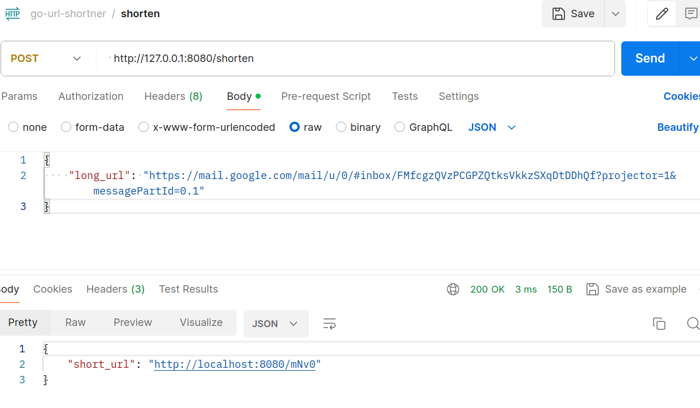
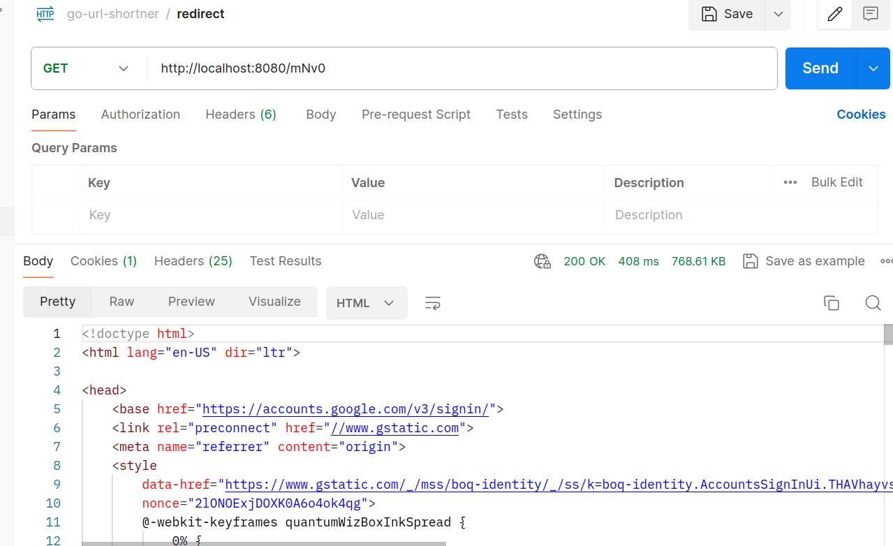
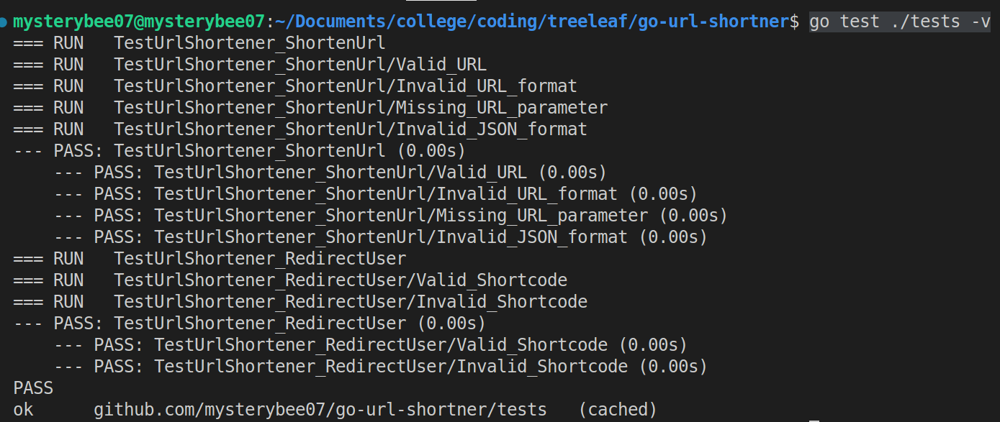

# go-url-shortner

This project is a simple URL shortener service built using Go and the Fiber web framework. It allows users to shorten long URLs and retrieve the original URLs using the shortened versions. The service is designed to be lightweight, fast, and easy to use.

Features
Shorten long URLs
Retrieve original URLs from shortened versions
Basic error handling for invalid URLs
Unit tests using github.com/stretchr/testify/assert

Prerequisites
Before running the service, ensure you have the following installed on your machine:

Go (go1.23.0)
Git

1. Installation
Clone the repository:

Using https:
    git clone https://github.com/mysterybee07/go-url-shortner.git
Using ssh:
    git clone git@github.com:mysterybee07/go-url-shortner.git

2. Redirect to the project directory
    cd go-url-shortener

3. Install dependencies: Use Go modules to install the required dependencies:

    go mod tidy

4. Running the Service
    To start the URL shortener service, run the following command in your terminal:

        go run main.go

    OR, you can use air command to enjoy live-reloading function if you have air installed in your device 
        
        air
    
    Follow the page below to install air
        https://github.com/air-verse/air

The service will start on http://localhost:8080 by default. 

5. API Endpoints

i. POST /shorten

Request Body: JSON object with the long URL
Response: JSON object with the shortened URL

ii. GET /{shortened}

Request: Access the shortened URL directly
Response: Redirects to the original long URL

1. Running Tests
To ensure that the service is functioning correctly, you can run the tests using the following command:

go test ./tests -v

This command will execute all tests in the project and display the results in the terminal. The tests are written using the github.com/stretchr/testify/assert package for easy assertions.

